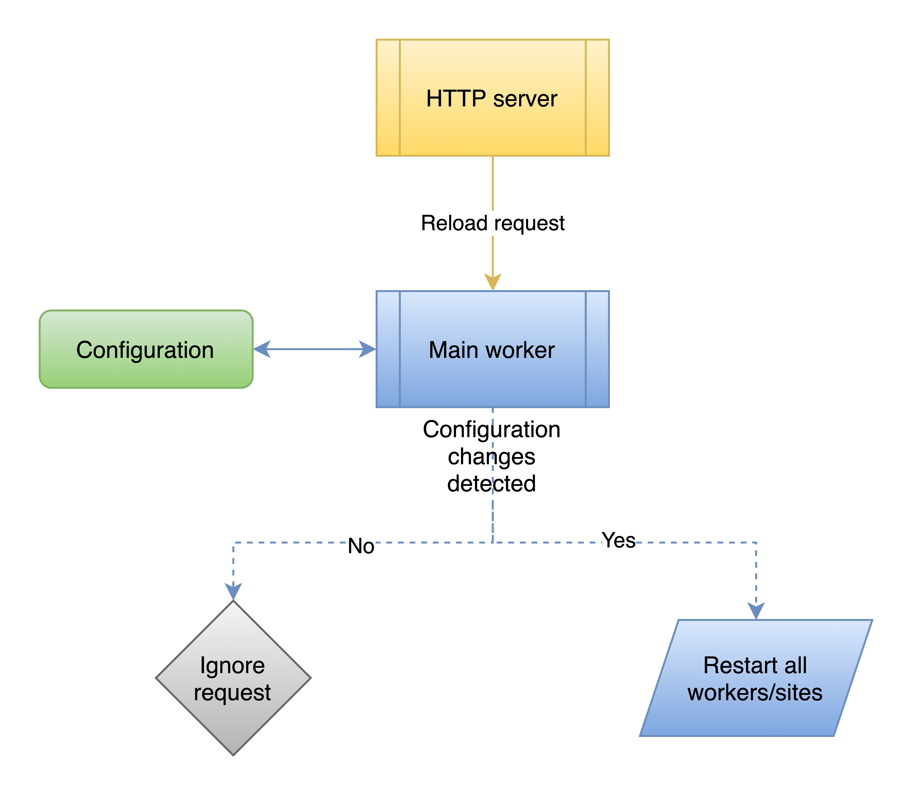

<!--
s3sync-service - Realtime S3 synchronisation tool
Copyright (c) 2020  Yevgeniy Valeyev

This program is free software: you can redistribute it and/or modify
it under the terms of the GNU General Public License as published by
the Free Software Foundation, either version 3 of the License, or
(at your option) any later version.

This program is distributed in the hope that it will be useful,
but WITHOUT ANY WARRANTY; without even the implied warranty of
MERCHANTABILITY or FITNESS FOR A PARTICULAR PURPOSE.  See the
GNU General Public License for more details.

You should have received a copy of the GNU General Public License
along with this program.  If not, see <http://www.gnu.org/licenses/>.
 -->

# Process flow

On start, the `s3sync-service` launches pool of generic upload workers, checksum workers and an FS watcher for each _site_. Once all of the above launched it starts comparing local directory contents with S3 (using checksums<->ETag and also validates StorageClass) which might take quite a while depending on the size of your data directory, disk speed, and available CPU resources.  All the new files or removed files  (if `retire_deleted` is set to `true`) are put into the upload queue for processing. The FS watchers, upload and checksum workers remain running while the main process is working, which makes sure that your data is synced to S3 upon change.


# Application reload

At the moment reload can be triggered manually with the following command:
```bash
> curl http://127.0.0.1:8090/reload -v
*   Trying 127.0.0.1...
* TCP_NODELAY set
* Connected to 127.0.0.1 (127.0.0.1) port 8090 (#0)
> GET /reload HTTP/1.1
> Host: 127.0.0.1:8090
> User-Agent: curl/7.64.1
> Accept: */*
>
< HTTP/1.1 200 OK
< Content-Type: application/json
< Server: s3sync-service
< Date: Wed, 04 Nov 2020 00:26:55 GMT
< Content-Length: 87
<
* Connection #0 to host 127.0.0.1 left intact
{"VERSION":"devel","STARTUPTIME":"2020-11-04T01:23:22.335032+01:00","STATUS":"RUNNING"}* Closing connection 0
```

Reload uses the following logic. Most of the configuration options can be changed using the reload apart from those that are set via [the command line arguments](configuration.md#command-line-args), logging level can be increased but not decreased.

In k8s environments reload is triggered by configmap changes, check [the k8s recipe for more details](running-on-k8s.md)


